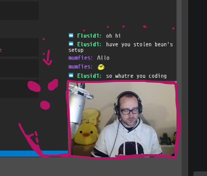

# Twitch HypeCam

## Accepts (Twitch API)

- bits (PubSub API)
- followers (/channel/<channel id>/follows)
- emoticons (Chat? tmi.js)
- subscribers (PubSub API)
- donations (NOPE)

## Overlay server

- takes token and authorises for use in OBS

## Game mechanics (pinball)

- Phaser JS (2D game engine)

## Game state

- Redux + redux-observables

## Packaging

- yarn v2 (.pnp.js)
